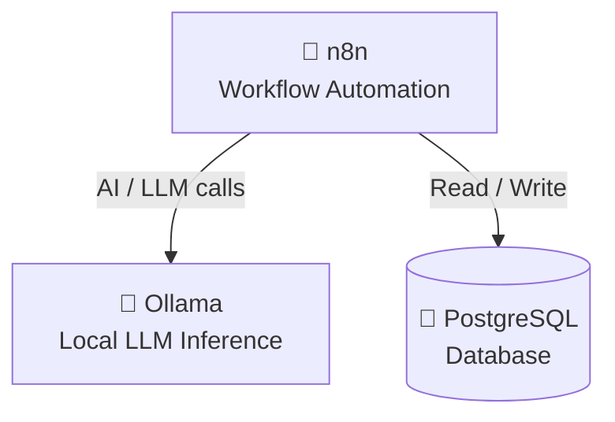
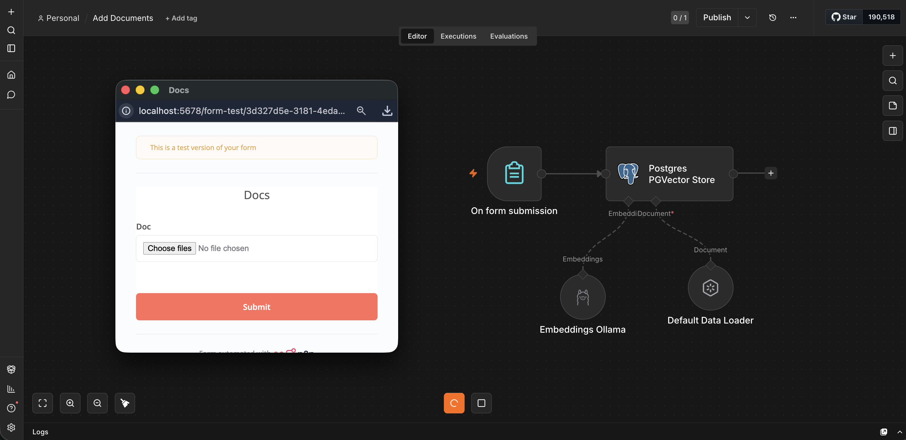
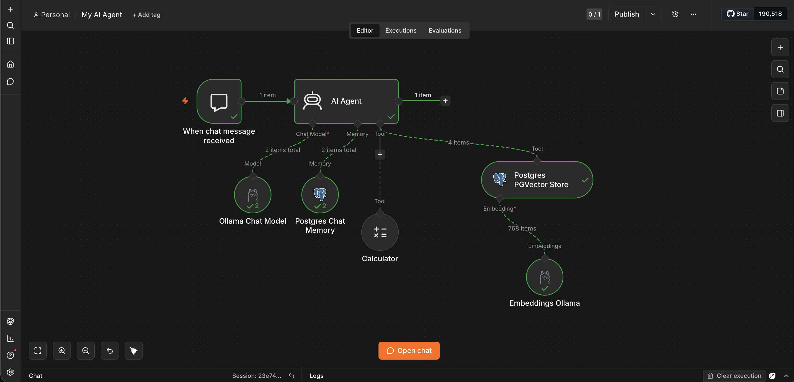
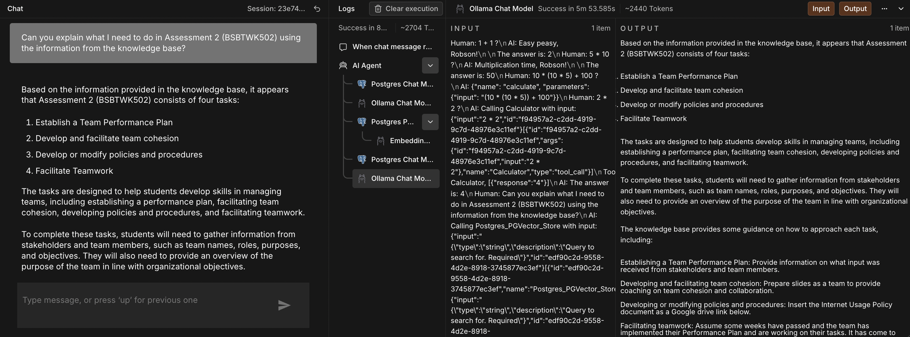

# n8n Compose Setup

This repository contains a Docker Compose configuration for running an n8n automation instance together with Ollama and PostgreSQL with pgvector support.

## Services

### `ollama`
### `n8n`
### `pgvector`

## Architecture



## How to Run

From the directory containing `compose.yaml`:

```bash
docker-compose up
```

This will start the three containers and make n8n available at `http://localhost:5678`.

## Images

These images illustrate the workflow and agent configuration used in this compose setup.

- **Add Documents Flow**
  
- **AI Agent Flow**
  
- **Test Chat**
  

## Notes

- The `ollama` container pulls the specified models on startup. If the model pull takes time, the container may appear busy until complete.
- `pgvector` is a PostgreSQL image with the `pgvector` extension installed, allowing vector storage and similarity search inside PostgreSQL.
- Adjust environment values, ports, or volumes as needed for your local setup.
